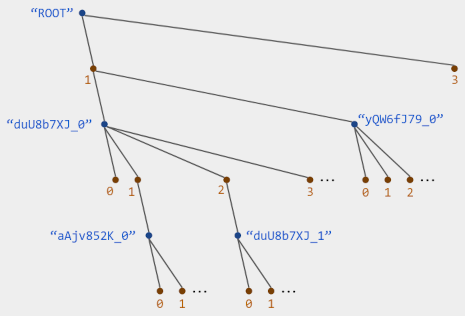
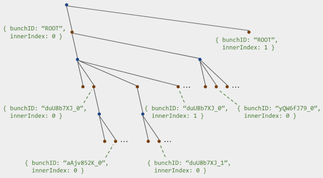
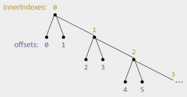

# Internals

## Tree Order

list-positions' core concept is a special kind of tree. Here is an example:



In general, the tree alternates between two kinds of layers:

- **Bunch layers** in which each node is labeled by a _bunch ID_ - a string that is unique among the whole tree. (Blue nodes in the image.)
- **Offset layers** in which each node is labeled by a nonnegative integer _offset_. (Orange nodes in the image.)

The tree's root is a bunch node with bunch ID `"ROOT"` (`BunchIDs.ROOT`).

The tree's nodes are totally ordered using a depth-first search: visit the root, then traverse each of its child nodes recursively. A node's children are traversed in the order:

- For bunch layers, visit the children in order by bunch ID. Specifically, use the lexicographic order on the strings `bunchID + ","`. (We'll explain the extra comma [later](#lexpositions).)
- For offset layers, visit the children in order by offset.

Each Order instance stores a tree of the above form. The tree's bunch nodes correspond to the bunches described in the readme. A bunch's BunchMeta `{ bunchID, parentID, offset }` says: I am a grandchild of the bunch node `parentID`, a child of its child `offset`.

The Position `{ bunchID, innerIndex }` indicates the offset node that is a child of `bunchID` and has offset `2 * innerIndex + 1`. Note that its offset is _not_ `innerIndex` (for reasons explained [later](#details)), but we still get an infinite sequence of Positions for each bunch. The sort order on Positions is just their order in the tree.



Now you can see why a Position depends on the BunchMeta of its bunch and all ancestors: you need these to know where the Position is in the tree. Once two Orders agree on some Positions' BunchMeta, they'll agree on the relative order of those Positions.

### Min and Max Positions

As a special case, the offset layer below the root always has exactly two nodes:

- Offset 1, which is `Order.MIN_POSITION` (innerIndex 0) and the ancestor of all other nodes.
- Offset 3, which is `Order.MAX_POSITION` (innerIndex 1).

This ensures that all other Positions are strictly between the min and max.

## Representing the Tree

We could choose to represent the tree literally, with one object per node and a pointer to its parent. But this would use a lot of memory and storage.

Instead, Order only stores an object per bunch node, of type [BunchNode](./README.md#interface-bunchnode); offset nodes are implied. Each BunchNode stores a pointer to the bunch node's "parent bunch node" (actually its grandparent), its offset (which tells you the actual parent node), and pointers to its "children bunch nodes" in tree order (actually its grandchildren). This info is sufficient to compare Positions and traverse the tree.

List, Outline, and LexList likewise avoid storing an object per Position/value. Instead, they store a map (BunchNode -> sparse array), where the sparse array represents the sub-map (innerIndex -> value) corresponding to that bunch. The sparse arrays use a run-length-encoded format that you can read about in the `...SavedState` doc headers.

## LexPositions

> For code implementing this section, see [LexUtils' source code](./src/lex_utils.ts).

We can address any node in the tree by the sequence of node labels on the path from the root that node:

```ts
[bunchID0 = "ROOT", offset0, bunchID1, offset1, bunchID2, offset2, ...]
```

For Positions besides the min and max, we always have `bunchID0 = "ROOT"` and `offset0 = 1`, so we can skip those. The rest we combine into a string to get the corresponding LexPosition:

```ts
`${bunchID1},${offset1}.${bunchID2},${offset2}.${bunchID3},${...}`
```

Note the commas and periods, which alternate; these make it easy to split a LexPosition back into its node labels. The node labels then tell you where the Position is in the tree - equivalently, all of its dependent BunchMetas.

We can create an analogous string for any (non-root) bunch node. That gives the bunch's [bunch prefix](./README.md#bunch-prefix). Since a Position `{ bunchID, innerIndex }` is just one layer deeper than its bunch's node, its LexPosition is just one label longer:

```ts
`${bunchPrefix},${(offset = 2 * innerIndex + 1)}`;
```

Special cases that are handled separately:

- The root's node prefix is defined to be `""`.
- The minimum LexPosition is `Order.MIN_LEX_POSITION = ""`. This is obviously less than all other LexPositions.
- The maximum LexPosition is `Order.MAX_LEX_POSITION = "~"`. This is greater than all other LexPositions because they all start with a bunch ID, and we mandate that every bunch ID is less than `"~"`.

### Lexicographic Order

Besides embedding dependencies, LexPositions have the nice property that their lexicographic order matches the tree order.

These two sort orders are a natural fit because they both sort by earlier layers first, using lower layers only as a tiebreaker. However, to make them exactly match, we need to do a few things specially:

1. We ban commas and periods in bunch IDs and offsets. Otherwise, the lexicographic order might not respect layer boundaries.
2. In the tree's depth-first search, we order bunch nodes not by bunch ID, but by `bunchID + ","`. This matches the lexicographic order when there are sibling bunch IDs like `"abc"` vs `"abc "`: descendant nodes will end up comparing `"abc,<...>"` vs `"abc ,<...>"`; the former is greater because `"," > " "`, even though in isolation `"abc" < "abc "`.
3. We can't encode offsets directly as strings, because the lexicographic order on numeric strings doesn't match the numeric order: `2 < 11` but `"2" > "11"`. Instead, we use the [lex-sequence](https://github.com/mweidner037/lex-sequence/#readme) package to convert offsets to base-36 strings that have the correct lexicographic order, while still growing slowly for large numbers (the encoding of `n` has `O(log(n))` chars).

## Creating Positions

You don't need to understand this section for the Applications below, but it's here for curiosity.

`Order.createPositions`, and its wrappers like `List.insertAt`, return Positions with the following guarantees:

1. They are unique among all Positions returned by this Order and its replicas. This holds even if a replica on a different device concurrently creates Positions at the same place.
2. Non-interleaving: If two replicas concurrently insert a (forward or backward) sequence of Positions at the same place, their sequences will not be interleaved.
3. The returned Positions will re-use an existing bunch if possible, to reduce metadata overhead.

To do this, we map Order's tree to a double-sided [Fugue list CRDT](https://arxiv.org/abs/2305.00583) tree, use a variant of Fugue's insert logic to create new nodes, then map those nodes back to Order's tree. Since Fugue is non-interleaving, so is list-positions. (Except in rare situations where Fugue interleaves backward insertions, documented in the linked paper.)

### Details

The conversion from list-position's tree to a Fugue tree is:

- Each Position becomes a Fugue node.
- A Position with nonzero innerIndex is a right child of the Position with one lower innerIndex. So each bunch's Positions form a rightward chain.
- For a bunch's first Position `pos = { bunchID, innerIndex: 0 }`, let the bunch's BunchMeta be `{ bunchID, parentID, offset }`.
  - If `offset` is even, then `pos` is a _left_ child of `{ bunchID: parentID, innerIndex: offset / 2 }`.
  - If `offset` is odd, then `pos` is a _right_ child of `{ bunchID: parentID, innerIndex: (offset - 1) / 2 }`.



Observe that the relation `offset = 2 * innerIndex + 1` lets each Position have both left and right children. Furthermore, there is a distinction between `innerIndex`'s right children and `(innerIndex + 1)`'s left children; that is necessary to prevent some backward interleaving.

Pedantic notes:

- list-positions makes different choices than the Fugue paper when inserting around tombstones. See the comments in [Order.createPositions' source code](./src/order.ts).
- The converted tree uses a slightly different sort order on same-side siblings than the Fugue paper: same-side siblings are in order by `bunchID + ","`, except that a right-side child created by the same Order as its parent is always last (because it increments `innerIndex` instead of creating a new right-child bunch). This does not affect non-interleaving because Fugue treats the same-side sibling sort order as arbitrary.

## Applications

Here are some advanced things you can do once you understand list-positions' internals. To request more info, or to ask about your own ideas, feel free to open an [issue](https://github.com/mweidner037/list-positions/issues).

1. Manipulate BunchMetas to make a custom tree. For example, to stitch together lists that originally used independent Orders (e.g., merged text blocks), create a fake bunch node that is a direct child of `{ parentID: "ROOT", offset: 1 }`, then attach each list's tree to an offset node within that bunch.
2. Rewrite list-positions in another language, with compatible Positions and LexPositions.
3. Rewrite just LexUtils in another language, so that you can at least manipulate LexPositions. This is much easier than rewriting the whole library. <!--, and sufficient for basic backend tasks like programmatically inserting text. TODO: needs LexUtils createPositions. -->
4. Write your own analog of our List class - e.g., to use a more efficient data representation, or to add new low-level features. You can use Order's BunchNodes to access the tree structure - this is needed for traversals, computing a Position's current index, etc.
5. Store a List's state in a database table that can be queried in order, more efficiently than storing each pair `(lexPosition, value)` as a separate row. You can probably store one _item_ per row, where an item is an array of values that use the same bunch, have sequential innerIndexes, and are still contiguous in the list order (no intervening values). To ensure the latter property, you'll have to "split" an item when you learn of intervening Positions. To allow in-order queries, each item could store a reference to its neighboring items in the list order (forming a doubly-linked list). Or, you can do recursive queries directly against the tree order - there's some discussion [here](https://github.com/vlcn-io/cr-sqlite/issues/65) but it might be over-complicated.
